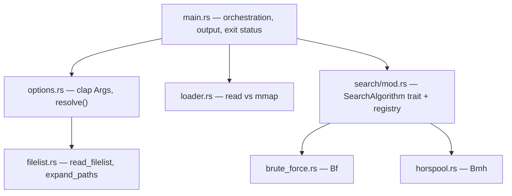

# greep

> _A small, threaded, literal-string grep — built to compare search algorithms, not to replace grep._

`greep` searches files for a **literal string** and prints the lines that contain it. It spawns one thread per input file, reads small files into memory and memory-maps large ones, and lets you swap the underlying substring-search algorithm with a flag. Its distinguishing feature is the built-in timing instrumentation: `-a` picks the algorithm and `-t` reports per-file and aggregate microsecond timings, so you can benchmark brute-force against Boyer-Moore-Horspool on your own files rather than on a synthetic benchmark.

It is deliberately not a grep replacement. There are no regular expressions, no case-insensitive matching, and **at most one match is reported per line**. If you want grep, use grep; if you want to see how different substring-search algorithms behave on real inputs, that's what this is for.

<!-- 🖊 TODO: Set project status — delete the others:
> **Status:** Active development — APIs and CLI flags may change between minor versions.
> **Status:** Stable — breaking changes only on major versions.
> **Status:** Experimental / proof-of-concept — use at your own risk.
> **Status:** Maintenance mode — no new features; bug fixes only.
-->

<p align="center">
  <a href="LICENSE"></a>
</p>

<!-- 🖊 TODO: The license badge is the only one backed by anything today. A CI
     badge becomes possible once issue #32 lands a workflow, and a release badge
     once there is a published release. -->

---

## Table of Contents

- [Features](#features)
- [Prerequisites](#prerequisites)
- [Installation](#installation)
- [Quick Start](#quick-start)
- [Usage](#usage)
- [Examples](#examples)
- [Exit Status](#exit-status)
- [Architecture](#architecture)
- [Known Limitations](#known-limitations)
- [Contributing](#contributing)
- [License](#license)

---

## Features

- **Swappable search algorithms** — `-a bf` (brute force) or `-a bmh` (Boyer-Moore-Horspool). Both are held to the same observable behavior by a cross-algorithm parity test, so `-a` is a performance choice, not a semantics choice.
- **Built-in timing instrumentation** — `-t` emits a per-file `#TIMING` line plus `#COMMAND` and `#TIMING_SUMMARY` lines with min/avg/max microseconds, bytes searched, match counts, and two throughput figures — search-only and wall-clock. Machine-readable, and on stderr so it never pollutes match output.
- **One thread per file** — files are searched in parallel, but output is emitted in argument order, so results are deterministic regardless of which thread finishes first.
- **Size-aware file loading** — files under 1 GiB are read into memory; files at or above 1 GiB are memory-mapped.
- **Recursive directory search** — pass a directory and it is walked automatically. No `-r` flag needed.
- **Binary files don't corrupt your terminal** — a file with a NUL byte in its first 8 KiB reports `Binary file X matches` instead of writing raw bytes to stdout, as grep does.
- **grep-compatible exit status** — `0` matched, `1` no match, `2` error, so `greep ... && ...` works the way you'd expect.
- **Batch input** — `-f FILELIST` reads paths from a file, one per line.

---

## Prerequisites

- **Rust toolchain** (`cargo`) — install via [rustup](https://rustup.rs).

Rust **1.85 or later** is required. This is declared as `rust-version` in
`Cargo.toml`, so Cargo enforces it rather than leaving you to discover it at a
compile error. The floor comes from the dependency tree — `clap` and
`assert_cmd` both require 1.85 — not from greep's own source, which needs
nothing newer than 1.65.

No system libraries are needed. `clap`, `memmap2`, and `thiserror` are pulled in by Cargo.

---

## Installation

`greep` is not published to crates.io, so build it from source:

```sh
git clone https://github.com/PeteRichardson/greep.git
cd greep
cargo build --release
# Binary: ./target/release/greep
```

### Verify

```sh
./target/release/greep --version
```

```
greep 0.1.0
```

---

## Quick Start

<!-- 🖊 TODO: A terminal GIF here would be the single highest-ROI addition to this
     README. Record with `vhs` or QuickTime, save to docs/images/demo.gif, and
     uncomment:
<p align="center">
  
</p>
-->

```sh
greep needle notes.txt
```

```
notes.txt:1 A needle in a haystack
notes.txt:3 needle needle needle
```

Output format is `path:line_number line`. Note that line 3 contains `needle`
three times but is reported once — see [Known Limitations](#known-limitations).

---

## Usage

```
Usage: greep [OPTIONS] [STRING] [FILES]...
```

### Arguments

| Argument | Description |
|----------|-------------|
| `STRING` | The literal string to search for. Required unless `-l` is given, and must not be empty. |
| `FILES...` | Files or directories to search. Directories are walked recursively. Defaults to `/dev/stdin` when omitted. |

### Options

| Flag | Description |
|------|-------------|
| `-a`, `--algorithm <ALGORITHM>` | Search algorithm code. One algorithm is used for the whole run. [default: `bf`] |
| `-f`, `--filelist <FILELIST>` | Read the file list from a file, one path per line. `#` comments and blank lines are skipped, a leading `~` expands, and repeats are collapsed — see [Search a list of files from a manifest](#search-a-list-of-files-from-a-manifest). Cannot be combined with positional `FILES`. |
| `-l`, `--list` | Print the available algorithm codes and exit. |
| `-t`, `--timing` | Print per-file `#TIMING` lines to stderr, then `#COMMAND` and `#TIMING_SUMMARY`. Independent of `-v`. |
| `-v`, `--verbose` | Print progress to stderr as files are processed. Independent of `-t`. |
| `-V`, `--version` | Print the version and exit. |
| `-h`, `--help` | Print help. |

### Algorithms

| Code | Algorithm |
|------|-----------|
| `bf` | Brute force (default) |
| `bmh` | Boyer-Moore-Horspool |

---

## Examples

### Search a single file

```sh
greep needle notes.txt
```

```
notes.txt:1 A needle in a haystack
notes.txt:3 needle needle needle
```

### Search several files at once

```sh
greep println src/main.rs notes.txt
```

```
src/main.rs:2     println!("hello");
```

Each file is searched on its own thread, but output is emitted in the order the
files were given, not the order the threads finish.

### Search a directory tree

```sh
greep needle .
```

```
./notes.txt:1 A needle in a haystack
./notes.txt:3 needle needle needle
```

Directories are recursed automatically. Dotfiles and dot-directories are skipped,
so a `.secret.txt` alongside `notes.txt` is not searched.

### Read from stdin

```sh
printf 'from stdin needle\n' | greep needle
```

```
/dev/stdin:1 from stdin needle
```

With no file arguments, `greep` reads `/dev/stdin`.

### Compare algorithm performance

```sh
greep -t -a bmh needle notes.txt
```

```
notes.txt:1 A needle in a haystack
notes.txt:3 needle needle needle
#TIMING        0 notes.txt
#COMMAND greep -t -a bmh needle notes.txt
#TIMING_SUMMARY algorithm=bmh files=1 errors=0 matched=1 matches=2 bytes=66 min=0 avg=0 max=0 algo_mbps=0.0 wall_mbps=0.6 wall_us=107
```

The timing figures vary from run to run; everything else above is reproducible.

The `#TIMING_SUMMARY` fields:

| Field | Meaning |
|---|---|
| `algorithm` | The algorithm code that ran. |
| `files` | Files **searched**, including ones that failed to open. |
| `errors` | Files that failed. |
| `matched` | Files with at least one match. |
| `matches` | Matching lines across every file. Binary files count here even though their lines are never printed. |
| `bytes` | Bytes searched, summed over files that succeeded. |
| `min` / `avg` / `max` | Per-file search time in microseconds. |
| `algo_mbps` | `bytes` ÷ summed per-file search time. Excludes I/O and excludes parallelism, so it is the figure that compares algorithms. |
| `wall_mbps` | `bytes` ÷ elapsed run time. What you actually waited for, including loading and every thread at once. |
| `wall_us` | Elapsed run time in microseconds, measured from after argument parsing. |

Both throughput figures use MB = 10⁶ bytes, and both are `0.0` when the run was
too short to measure. **The two differ by roughly the parallelism factor** —
`algo_mbps` is the one to quote when comparing `bf` against `bmh`, and
`wall_mbps` is the one that answers "how fast was my search".

On a real workload the difference between the algorithms is visible directly:

```
#TIMING_SUMMARY algorithm=bf  files=8 errors=0 matched=8 matches=122 bytes=43414 min=11 avg=27 max=64 algo_mbps=199.1 wall_mbps=188.8 wall_us=230
#TIMING_SUMMARY algorithm=bmh files=8 errors=0 matched=8 matches=122 bytes=43414 min=8  avg=20 max=47 algo_mbps=264.7 wall_mbps=229.7 wall_us=189
```

Matches go to stdout; every `#`-prefixed line goes to stderr. Redirect one away
from the other to keep them separate:

```sh
greep -t -a bmh needle big.txt > matches.txt 2> timings.txt
```

### Trace which files are being processed

```sh
greep -v needle notes.txt
```

```
# Searching for 'needle'
# Processing file 0: notes.txt
notes.txt:1 A needle in a haystack
notes.txt:3 needle needle needle
```

### Search a list of files from a manifest

```sh
greep -f files.txt needle
```

`files.txt` holds one path per line. This cannot be combined with positional file
arguments.

```
# Sources worth searching                 <- comments start with #
src/main.rs
src/options.rs
                                          <- blank lines are skipped
~/notes/scratch.txt                       <- a leading ~ expands to $HOME
src/main.rs                               <- a repeat is ignored
```

The rules, and their edges:

- **Blank lines are skipped.**
- **A line whose first non-blank character is `#` is a comment.** Only whole
  lines — a trailing `#` is *not* stripped, because `#` is legal in a filename
  and `notes#2.txt` has to stay openable. To list a file whose name really does
  begin with `#`, write it as `./#name`.
- **A leading `~` or `~/` expands to `$HOME`.** Nothing else would expand it: a
  manifest is read by greep, not by your shell. `~user` is not supported and is
  left alone, as is a `~` anywhere but the start.
- **Repeated paths are collapsed to their first occurrence**, so the surviving
  order is first-seen. Deduplication happens after `~` expansion, so `~/a.txt`
  and `$HOME/a.txt` count as the same file.
- **Leading whitespace is not stripped from a path**, since it is legal in a
  filename. Indent comments freely; don't indent paths.

---

## Exit Status

`greep` follows grep's convention, so it composes with shell conditionals:

| Code | Meaning |
|------|---------|
| `0` | At least one match was found. |
| `1` | No matches were found. |
| `2` | An error occurred (unreadable file, bad argument, unknown algorithm). |

An error outranks a match: a run that both matched something and failed to open
another file exits `2`.

```sh
# Distinguishes "no match" from "the file was missing"
greep needle nope.txt; echo "exit=$?"
```

```
error: nope.txt: No such file or directory (os error 2)
exit=2
```

---

## Architecture



| Module | Responsibility |
|--------|----------------|
| `src/main.rs` | Thread spawn/join, buffered output, timing summary, exit status. |
| `src/options.rs` | `clap`-derived `Args`, `AppError`, and `resolve()` — validates the algorithm, picks the file source, expands directories. |
| `src/filelist.rs` | Reading a `-f` manifest and walking directories. |
| `src/loader.rs` | `load()` — reads files under 1 GiB, memory-maps files at or above it. |
| `src/search/` | The `SearchAlgorithm` trait, the code registry, and the two implementations. |

Threads are joined in spawn order, and each file's matches are written out and
freed as its thread lands — which is both what makes output deterministic and
what keeps match text from accumulating across the whole run.

---

## Known Limitations

These are current, verified behaviors rather than hypotheticals. Each links to its tracking issue where one exists.

- **At most one match reported per line.** A line containing the search string three times is printed once. Both algorithms behave this way by design.
- **Literal strings only.** No regular expressions, no case-insensitive matching, no word-boundary matching. There is no `-i`, `-w`, `-c`, `-q`, or `-n`.
- **An empty search string is an error, not a wildcard.** `grep ""` matches every line; `greep ""` exits `2` with `error: search string must not be empty`. Rejecting it was chosen over silently matching nothing, which is what it used to do.
- **Binary detection has a bounded window and no override.** Only the first 8 KiB of a file is inspected for a NUL byte, so a file that turns binary later is treated as text. There is also no `grep -a`/`--text` equivalent to force a binary file to print its matching lines.
- **A search string containing a newline never matches.** Search is line-scoped and no line contains a newline, so both algorithms agree on this and exit `1`.
- **Hidden files are always skipped** ([#25](https://github.com/PeteRichardson/greep/issues/25)). Dotfiles and dot-directories are excluded from directory walks, with no opt-out flag.
- **Symlinks inside a directory are skipped silently** ([#24](https://github.com/PeteRichardson/greep/issues/24)). This matches `grep -r`'s default. Note the asymmetry: a symlink passed *explicitly* as an argument **is** followed — only the directory walk skips them.
- **Thread count is unbounded** ([#15](https://github.com/PeteRichardson/greep/issues/15)). One thread is spawned per file with no pool or cap. Fine for thousands of small files; the risk case is many concurrently-large files.
- **Non-UTF-8 filenames are mangled** ([#39](https://github.com/PeteRichardson/greep/issues/39)). Paths round-trip through lossy UTF-8 conversion, which can produce an unopenable path. Unreachable on macOS (APFS enforces UTF-8); a real bug on Linux.
- **No CI** ([#32](https://github.com/PeteRichardson/greep/issues/32)). The test suite is not run automatically on push.

<!-- 🖊 TODO: Review this list — it was assembled from open issues and verified by
     running the binary, but you may want to cut items you consider out of scope
     rather than defects, or add trade-offs a reader should know that aren't
     tracked as issues. -->

---

## Contributing

There is no `CONTRIBUTING.md` yet. In the meantime:

```sh
git clone https://github.com/PeteRichardson/greep.git
cd greep
cargo test                          # unit + integration tests
cargo clippy --all-targets          # lints
cargo fmt --check                   # formatting
```

Please open an issue before starting significant work. Findings from repository
audits are tracked as GitHub issues with `severity:`, `effort:`, and `category:`
labels.

---

## License

Licensed under the **MIT License** — see [LICENSE](LICENSE) for the full text.

Copyright © 2021–2026 Pete Richardson.
